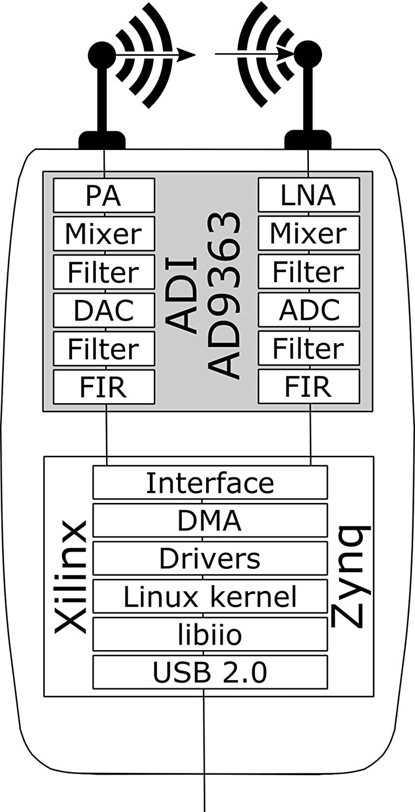
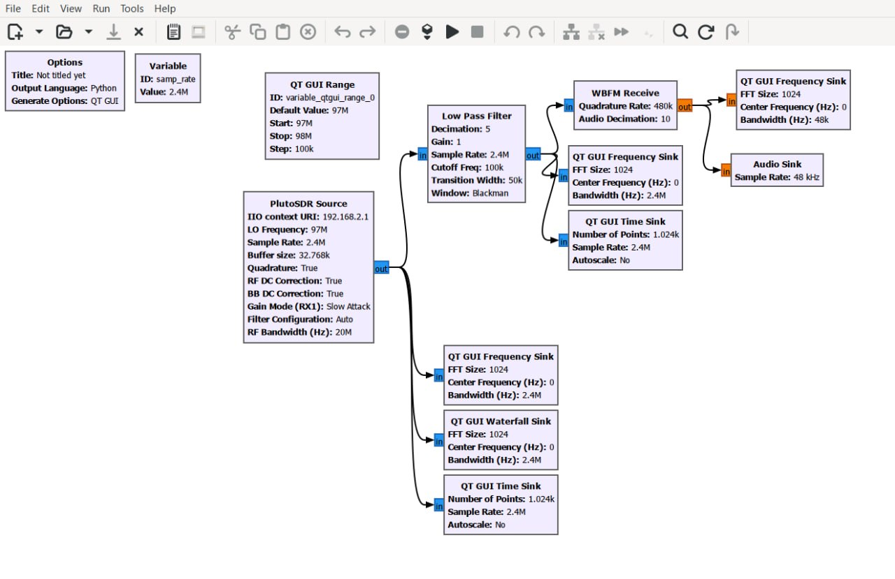
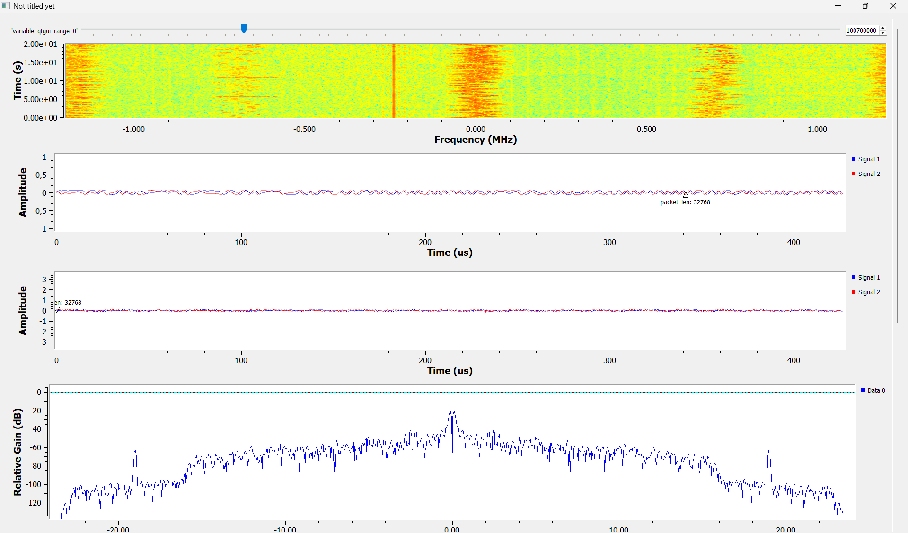
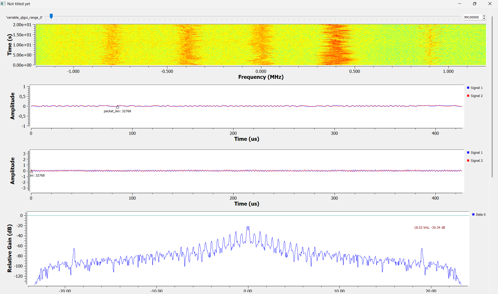

## Тема занятия: Архитектура  Adalm Pluto SDR. GNU Radio. Построение радио-приёмника

### Целью данной работы является: 

1. Изучение архитектуры Adalm Pluto SDR
2. Установка и изучение GNU Radio Companion
3. Сборка радиоприемника на устройстве Adalm PLuto 

### Теория:

GNURadio - это инструмент с открытым исходным кодом для разработки программного обеспечения в сфере программно-определяемого радио. Инструмент позволяет при помощи “строительных блоков” создать конфигурацию радиоустройства, не написав ни одной строчки кода, и запустить программу непосредственно с использованием модуля SDR (программно-определяемое радио), например Adalm-Pluto, LimeSDR, и др.

В библиотеке имеется широкий спектр функций\методов по цифровой обработки сигнала. Модули написаны на языке C++, а их взаимодействие на блоков друг с другом - на Python. Приложения можно строить как путём работы с API GNURadio, так и посредством GUI-приложения GNU Radio Companion.

  

### Выполнение работы:

После небольшой лекции по устройству Adalm Pluto мы перешли к практике. Я установил необходимый софт + драйвера и приступил к сборке радиоприемника из блоков. 

Для сборки радиоприемника мне понадобились следующие блоки:

1. PlutoSDR Source (для приема сигнала с Adlam Pluto и настройки несущей частоты FM-станции + частоты дискретизации)
2. QT GUI Frequence Sink (для отображения спектральной плотности мощности относительно несущей частоты)
3. Low Pass Filter (для подавление лишнего сигнала на частотах, отличных от среза искомой полосы FM-станции)
4. QT GUI Time Sink (для отображения сигнала во временной шкале)
5. WBFM Receive (для демодуляции широковещательного FM-сигнала)
6. Audio Sink (для воспроизведения аудио-потока в динамиках/наушниках ПК)
7. Необязательные блоки (ползунок для выбора частоты и тд.)

  

После множества попыток и смены Adalm Pluto, я наконец то смог поймать сигнал и послушать радио.

  

  

### Вывод:

В ходе выполнения лабораторной работы я ознакомился с архитектурой радиомодуля Adalm Pluto SDR, а также освоил графический интерфейс и базовый функционал среды GNU Radio Companion. Была успешно спроектирована, собрана и отлажена блок-схема FM-приемника. 

