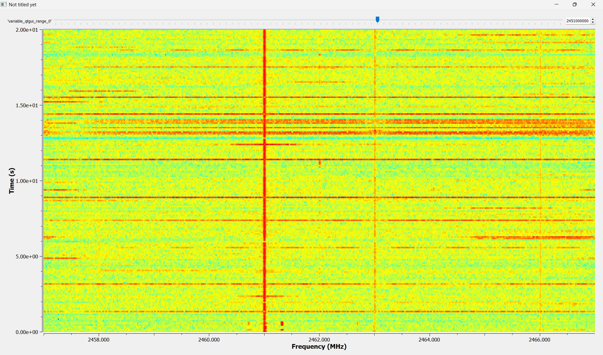
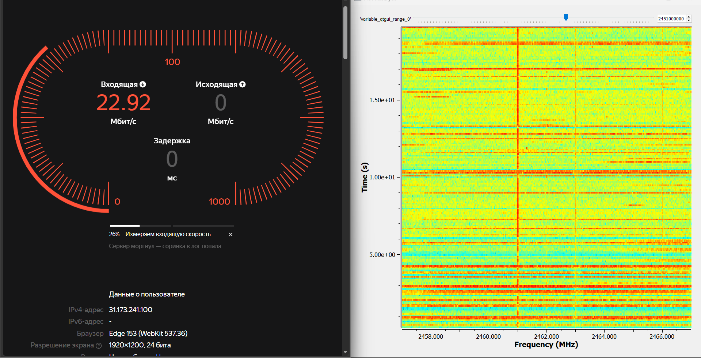

# ДОПИСАТЬ!!!
## Тема занятия: GNU Radio. Построение радио-приёмника, радио-передатчика.

### Целью данной работы является:

### Теория:

### Выполнение работы:

Нужно было на частотах WI-FI найти частоту, на которой работает моя мобильная точка доступа и посмотреть.

  

  

### Вывод: 
